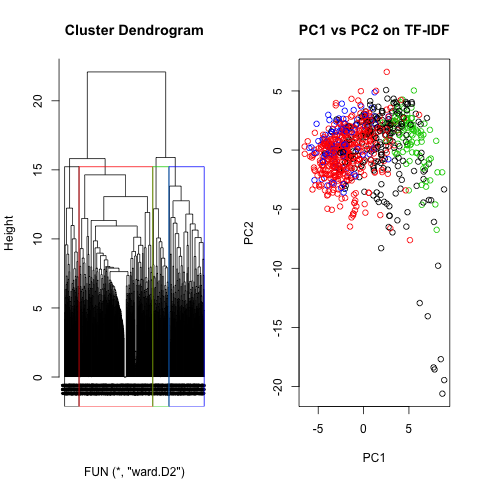

[](http://quantlet.de/)

## [](http://quantlet.de/) **Textmining_Abstracts** [](http://quantlet.de/)

```yaml

Name of Quantlet : Textmining_Abstracts

Published in : <‘> Not published <‘>

Description : 'Performs K-means and Hierarchical clustering in an attempt to find coherent clusters
of abstracts, based on the project group of the article<‘>s author'

Keywords : Textmining, TFIDF matrix, clustering, K-means, Hierarchical clustering

See also : 'ScrapeAbstracts, ScrapeArticles, ScrapeJEL, PDF_2_TXT, StemTFIDF_Abstracts, StemJEL,
TopicModelling_Articles'

Author : Ken Schröder, Johannes Stoiber

Submitted : Fri, Feb 10 2017 by Ken Schröder

Datafile : Abstract_infotable.Rdata, Abstract_TDMs.Rdata, JEL_descr.Rdata

```





### R Code:
```r
library(cluster)

load("Textmining_Abstracts/Abstract_TDMs.Rdata")      # Opens as "TDM"
load("Textmining_Abstracts/Abstract_infotable.Rdata") # Opens as "abstr_info"


########################################################################

#### 0. Functions for this script
#### 1. Some analysis of the TDM, TFIDF 
####      a. Inspect term frequencies
####      b. Clustering
#### 2. Visualizations of clustering & PCA

########################################################################


### 0. Functions for this script:                                  #####

  # inspect the terms present in the Document-Term-Document 
  getfreq = function(dtm){
    freqs = colSums(as.matrix(dtm))
    return(freqs[order(-freqs)])
  }

  # function to extract only letters from string
  keep.letter = function(x){gsub("[^[:alpha:]]", "", x)}
  
  # function to extract the project code
  get_pcode = function(projectcode){
    p.code = substr(projectcode, 1, 3)
    p.code = keep.letter(p.code)
    return(substr(p.code, 1,1 ))
  }
  
  # get the right information from PCA output
  pca.man = function(X,tau=.1){
    pca = prcomp(X,center=TRUE, scale=TRUE)
    var = pca$sdev^2
    idx = which(cumsum(var)/sum(var) > tau)[1]
    pca$idx = idx
    return(pca)
  }


### 1. Some analysis of the TDM, TFIDF                               #####

  ## a. Inspect term frequencies: 
  freqs = lapply(TDM, getfreq)
  
  # Establish baseline for clustering accuracy:
  # We use projectcode, because 4 - 5 clusters are identified by
  # dendrogram. Rough_pcode is the "true" group. We'll compare this
  # with the clusters assigned by the clustering algorithms
  rough_pcode = get_pcode(abstr_info$projectcode)

  ## b. Clustering
  # Compute distance between document vectors:
  d = lapply(TDM, function(x){dist(as.matrix(x), method = "manhattan")})
  
    ## Hierarchical clustering using Ward's method.
    group = lapply(d, hclust, method = "ward.D2")
    # table predictions vs. project codes (Hierarchical clustering, Ward's):
    ward_fit = lapply(group, function(x){ table(cutree(x, 4), rough_pcode)})
  
    ## K-means
    kfit = lapply(d, function(x){kmeans(x, 4, nstart = 100)$cluster})
    # table predictions vs. project codes (kmeans)
    kmeans_fit = lapply(kfit, table, rough_pcode)
  

#### 2. Visualizations of Clustering for TF/IDF                        #####
  
  ### PCA 
    # apply PCA to all matrices, add additional field to each entry
    # that indicate how much PC we need for a certain explanatory level
    pca = lapply(X = c(1:length(TDM)), function(x){
      pca.man(as.matrix(TDM[[x]]), tau = 0.3)})
    
    # PCA plot for TF-IDF matrix and Screeplot
    png("Textmining_Abstracts/Textmining_Abstracts.png")
      par(mfrow = c(1, 2))
      plot(pca[[5]], type = "l", 
         main = paste0("Screeplot, 10% explained by first ", pca[[5]]$idx," PC"))
      plot(pca[[5]]$x[,c(1,2)], col =  as.factor(rough_pcode), 
         main = "PC1 vs PC2 on TF-IDF")
    dev.off()
    
    # Hierarchical Ward clustering
    png("Textmining_Abstracts/Textmining_Abstracts-1.png")
      par(mfrow = c(1, 2))
      plot(group[[5]], hang = -1, cex = .6, xlab = "")
      rect.hclust(group[[5]], k = 4, border = 1:4)
      plot(pca[[5]]$x[,c(1,2)], col =  cutree(group[[5]],4), 
           main="PC1 vs PC2 on TF-IDF")
    dev.off()
    
    # K-means
    png("Textmining_Abstracts/Textmining_Abstracts-2.png")
      par(mfrow = c(1,1))
      plot(pca[[5]]$x[,c(1,2)], col =  kfit[[5]], 
         main = "PC1 vs PC2 on TF-IDF (color: k-means clusters)")
    dev.off()
    #kmeans_fit[[5]]
    
    # Silhouette information 
    png("Textmining_Abstracts/Textmining_Abstracts.png-3.png")
      par(mfrow = c(2,1))
      plot(silhouette(cutree(group[[5]],4),d[[5]])[,3], 
           main="Silhouette hierarchical clustering", col=cutree(group[[5]],4))
      plot(silhouette(kfit[[5]],d[[5]] )[,3], main = "Silhouette k-means", 
           col = kfit[[5]])
    dev.off()
    
    #mean(silhouette(cutree(group[[5]],4),d[[5]])[,3])
    #mean(silhouette(kfit[[5]],d[[5]] )[,3])
    
    

```
